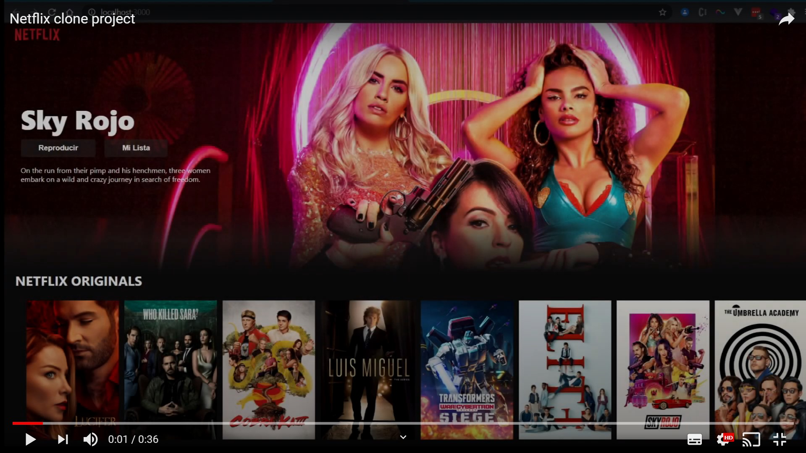

### Proyecto Clon de Netflix

#### - Instalar dependencias
`yarn install`

#### - Arranque proyecto
`yarn start` 
La aplicación se abre en [http://localhost:3000](http://localhost:3000)

#### - Vídeo demo
